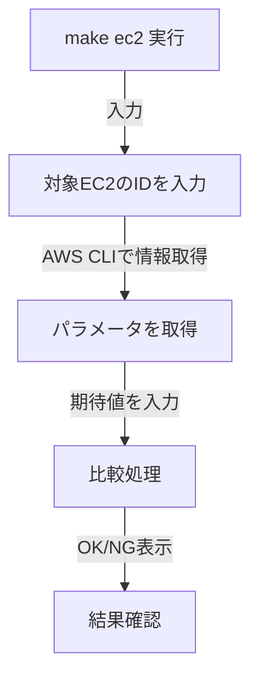

# 対話型パラメータテスト 設計書

## 1. 概要
本設計書は、AWS上のEC2のパラメータテストを対話型で実施する仕組みについて定義する。

## 2. 目的
- AWSリソース（EC2）の設定が期待通りであることを手動で確認する。
- Terraformに依存せず、AWS CLIを使用して設定の正当性を検証する。

## 3. 前提条件
- `aws` CLI がインストールされ、適切な権限で設定されていること (`aws configure`)
- `jq` コマンドが利用可能であること（例：`sudo yum install -y jq`）
- AWS環境にテスト対象のEC2が存在すること

## 4. システム構成

### 4.1 遷移図
以下の図は、EC2のパラメータテストの流れを表したものである。

    
## 5. テスト対象リソースとパラメータ

### 5.1 EC2
| パラメータ | 説明 |
|-----------|------|
| instance_type | インスタンスタイプ |
| ami | AMI ID |
| private_ip | プライベートIPアドレス |
| subnet_id | サブネットID |
| vpc_security_group_ids | セキュリティグループID（複数可） |
| key_name | SSHキー名 |
| iam_instance_profile | IAMインスタンスプロファイル |

## 6. 実行コマンド一覧
| コマンド | 説明 |
|---------|------|
| `make ec2` | EC2のパラメータテストを実行 |

## 7. 成果物
- 本テストの結果は、標準出力で確認すること
